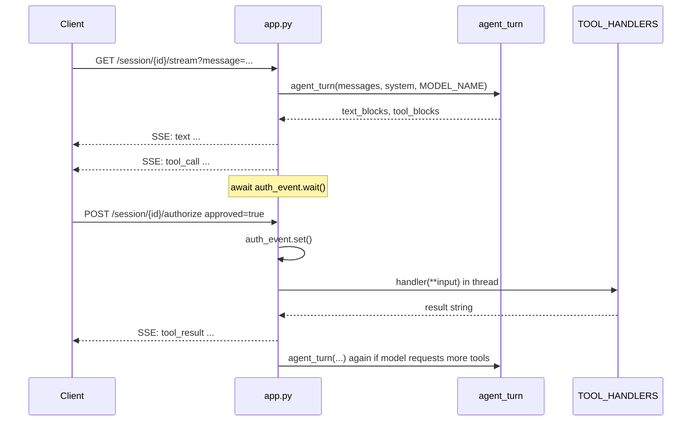

# How the backend works

This document describes the **Python backend** of the Analytics Content Agent: the **agent core** (`agent.py`) and the **HTTP API** (`app.py`). Together they expose a Claude-powered assistant with filesystem tools, Docker-isolated execution, optional skills, and **human-in-the-loop** approval for each tool call over Server-Sent Events (SSE).

---

## Big picture

| Layer | File | Role |
|--------|------|------|
| **Agent core** | `agent.py` | Anthropic client, tool definitions and handlers, skills catalog/selection/loading, and `agent_turn` (one API round-trip without executing tools). |
| **API + orchestration** | `app.py` | FastAPI app: uploads CSV, in-memory sessions, SSE stream that loops `agent_turn` + tool execution, `asyncio.Event` to pause until the user approves or denies a tool. |

The frontend (or any client) talks only to `app.py`. `app.py` imports from `agent.py` and never duplicates tool logic.

---

## `agent.py` — agent core

### Purpose

`agent.py` implements a **Claude “local sandbox” agent**: the model can call tools that read/write a local **workspace**, run **bash inside Docker** with tight limits, and optionally receive **markdown skills** as extra system context.

### Configuration and paths

- **`ANTHROPIC_API_KEY`** (required): loaded via `python-dotenv` for the Anthropic client.
- **`BASE_DIR`**: directory containing `agent.py`.
- **`SKILLS_DIR`**: `BASE_DIR.parent / "skills"` — expects each skill in `skills/<name>/SKILL.md` with a simple YAML front matter (`name`, `description`, etc.).
- **`WORKSPACE`**: `BASE_DIR / "workspace"` — user data and CSVs; mounted into the sandbox container for `bash`.
- **`OUTPUTS`**: `BASE_DIR / "outputs"` — artifacts the agent may produce; also mounted in the sandbox.

`WORKSPACE` and `OUTPUTS` are created on import if missing.

### Tools exposed to Claude

The `TOOLS` list registers four Anthropic tools:

| Tool | What it does |
|------|----------------|
| **`bash`** | Runs a shell command inside a **Docker** container (`claude-sandbox` image), with `--network none`, memory/CPU limits, 60s timeout, workspace and outputs bind-mounted. |
| **`create_file`** | Creates a file under `WORKSPACE` (creates parent dirs as needed). |
| **`view`** | Reads a file or lists a directory under `WORKSPACE`. |
| **`str_replace`** | Replaces **exactly one** occurrence of `old_str` in a file (if count ≠ 1, returns an error string). |

Handlers live in `TOOL_HANDLERS`: a map from tool name to Python callable. All handlers return **strings** (or stringified results) that become `tool_result` content for the API.

### Skills pipeline

1. **`_build_skills_catalog()`** — Scans `SKILLS_DIR/**/SKILL.md`, parses only the **YAML header** of each file, and builds a catalog: skill name → `[short description, absolute path]`. Full skill bodies are not loaded here (saves tokens).
2. **`_select_skills(prompt, catalog, model_name)`** — Calls the Anthropic API with a **small** user message listing the catalog and asking for a **JSON array** of relevant skill names. The response is cleaned (markdown code fences stripped) and parsed; only names that exist in the catalog are kept.
3. **`load_skills(names)`** — Reloads the catalog, then for each selected name reads the **full** markdown and concatenates fragments wrapped in `<skill name='...'>...</skill>`.

There is also **`run_agent(prompt, ...)`**: a **standalone CLI loop** that selects/loads skills, calls `messages.create` in a loop, runs every tool immediately, and appends assistant + tool results to history. The **FastAPI app does not use `run_agent`**; it uses the slimmer contract below.

### `agent_turn` — one model step (used by FastAPI)

```text
agent_turn(messages, system="", model_name=...) → (text_blocks, tool_blocks)
```

- Performs a **single** `client.messages.create(...)` with `tools=TOOLS` and the given `messages` / `system`.
- Returns:
  - **`text_blocks`**: list of `text` content blocks from the response.
  - **`tool_blocks`**: list of `tool_use` blocks (name, id, input).
- **Does not** execute tools or loop. The **caller** (`app.py`) decides when to run handlers, when to wait for human approval, and when to call `agent_turn` again with updated history.

---

## `app.py` — FastAPI backend

### Purpose

`app.py` exposes HTTP endpoints for:

- Uploading a CSV into `workspace/`.
- Creating a **session** with **auto-selected skills** (based on the CSV name).
- **Streaming** the conversation over **SSE**, pausing on each tool call until **`POST .../authorize`**.
- Listing and downloading files from `outputs/`.

### Global settings

- **`MODEL_NAME`**: from environment variable `MODEL_NAME`, default `claude-sonnet-4-5-20250929`. Used for **`agent_turn`** in the stream (see note below on session creation).

### Session model (in-memory)

Each session is a **`Session`** instance:

| Field | Meaning |
|--------|---------|
| `messages` | Anthropic-style chat history (user/assistant turns, including `tool_use` / `tool_result` payloads built by this file). |
| `system` | String built from `load_skills` at session creation (may be empty). |
| `pending` | While waiting for the user: `dict` with `id`, `name`, `input` of the current tool call; otherwise `None`. |
| `auth_event` | `asyncio.Event` — cleared before waiting; **`wait()`** blocks the SSE generator until authorize sets it. |
| `auth_approved` | Set from the authorize body: whether to run the handler or return a denial result. |

Sessions live in a module-level dict **`sessions: dict[str, Session]`** keyed by UUID string. There is no persistence across process restarts.

### Endpoints

| Method | Path | Behavior |
|--------|------|----------|
| `POST` | `/upload-csv` | Multipart upload; writes bytes to `WORKSPACE / filename`. |
| `POST` | `/session` | Body: `csv_name`, optional `model` (defaults to `MODEL_NAME`). Builds catalog in a thread, selects skills with `_select_skills(f"analisar {csv_name}", ...)`, loads skill bodies with `load_skills`, creates `Session(system=...)`, returns `session_id` and `skills` list. |
| `GET` | `/session/{session_id}/stream?message=...` | **SSE** stream: appends user message, then loops calling `agent_turn` in a thread, emitting events (see below). |
| `POST` | `/session/{session_id}/authorize` | Body: `{ "approved": true|false }`. Sets `auth_approved` and **`auth_event.set()`** so the stream unblocks. Returns 400 if nothing is pending. |
| `GET` | `/outputs` | Lists allowed extensions under `OUTPUTS/`. |
| `GET` | `/outputs/{filename}` | Serves a file from `OUTPUTS/`. |

CORS is enabled for all origins (typical for a local/dev frontend).

### SSE event flow (high level)

1. Client opens **`GET /session/{id}/stream?message=...`**.
2. Server appends `{"role": "user", "content": message}` to `session.messages`.
3. If `session.system` is non-empty, emits **`skills_selected`** once (payload is minimal in code: `{"type": "skills_selected"}`).
4. Loop:
   - **`agent_turn`** (thread) → text streamed as **`text`** events; tool calls collected.
   - If **no** tool calls: append assistant message to history, emit **`done`**, end stream.
   - If there **are** tool calls: for **each** tool, in order:
     - Set `session.pending`, **`auth_event.clear()`**, emit **`tool_call`** (id, name, input).
     - **`await session.auth_event.wait()`** until the client calls **`POST /authorize`**.
     - If approved: run **`TOOL_HANDLERS[name]`** in a thread, append `tool_result`, emit **`tool_result`**.
     - If denied: append a `tool_result` with denial text, emit **`tool_denied`**.
   - Append assistant message (text + `tool_use` blocks) and a user message with all `tool_result` blocks, then **continue** the outer loop for the next `agent_turn`.

Errors from `agent_turn` yield an **`error`** event and break the loop.

### Assistant message shape stored in history

The stream builds `response_content` as:

- One entry per text block: `{"type": "text", "text": ...}`.
- One entry per tool: `{"type": "tool_use", "id", "name", "input"}`.

That matches what the Anthropic API expects when you replay assistant content as plain dicts in `messages`.

### Implementation note: model selection

- **`POST /session`** passes `body.model` into **`_select_skills`** only (skill picking).
- **`GET .../stream`** always passes **`MODEL_NAME`** (env/default) into **`agent_turn`**, not the per-request `model` from session creation.

So the **main** chat model is fixed by **`MODEL_NAME`** unless you change `app.py` to store the chosen model on `Session` and pass it through.

---

## Sequence: user message → tool → approve → next turn



---

## Dependencies between files

```text
app.py
  imports: agent_turn, TOOL_HANDLERS, WORKSPACE, OUTPUTS,
           _build_skills_catalog, _select_skills, load_skills

agent.py
  imports: anthropic, dotenv, subprocess, pathlib, etc.
  no imports from app.py
```

---

## Running the API

Typical command (see your `Dockerfile` or local setup):

```bash
uvicorn app:app --host 0.0.0.0 --port 8000
```

Ensure **`ANTHROPIC_API_KEY`** is set, Docker is available if you use **`bash`**, and the **`claude-sandbox`** image exists if tool calls hit the sandbox.

Interactive docs: `http://localhost:8000/docs`.
