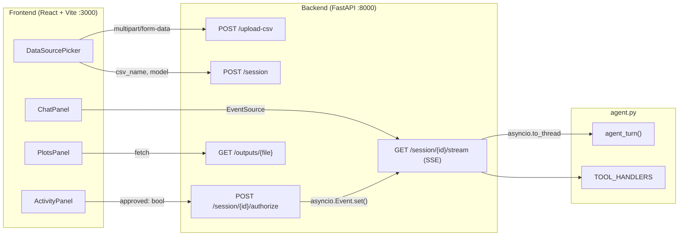
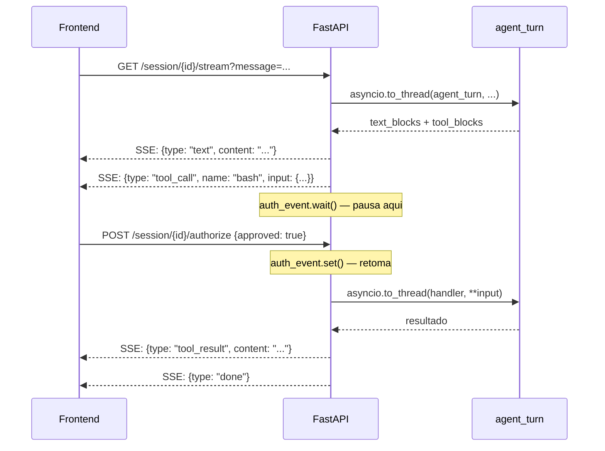

# Interface FastAPI + React para o Agente

## Arquitetura geral



## Fluxo de autorização (SSE + asyncio.Event)



## Estrutura de arquivos

```
analytics_content_agent/
├── app.py              # REESCREVER: FastAPI backend (era Streamlit)
├── agent.py            # manter (agent_turn já existe)
├── Dockerfile          # CRIAR: imagem do backend
├── docker-compose.yml  # CRIAR: orquestra backend + frontend
└── frontend/           # CRIAR: React + Vite
    ├── src/
    │   ├── App.jsx
    │   └── components/
    │       ├── DataSourcePicker.jsx
    │       ├── ChatPanel.jsx
    │       ├── ActivityPanel.jsx
    │       └── PlotsPanel.jsx
    ├── package.json
    ├── vite.config.js
    └── Dockerfile
```

## Backend: `app.py` (FastAPI)

### Session em memória
```python
class Session:
    messages: list
    system: str
    pending: dict | None       # tool call aguardando autorização
    auth_event: asyncio.Event  # pausa o SSE stream
    auth_approved: bool

sessions: dict[str, Session] = {}
```

### Endpoints
| Método | Rota | Descrição |
|--------|------|-----------|
| `POST` | `/upload-csv` | Salva arquivo em `workspace/` |
| `POST` | `/session` | Cria sessão, seleciona skills, retorna `session_id` |
| `GET`  | `/session/{id}/stream?message=...` | SSE: executa agente e emite eventos |
| `POST` | `/session/{id}/authorize` | `{approved: bool}` — libera ou nega tool call pendente |
| `GET`  | `/outputs` | Lista arquivos em `outputs/` |
| `GET`  | `/outputs/{filename}` | Serve arquivo gerado |

### Formato dos eventos SSE
```
data: {"type": "skills_selected", "skills": [...]}
data: {"type": "text", "content": "..."}
data: {"type": "tool_call", "name": "bash", "input": {...}, "id": "..."}
data: {"type": "tool_result", "content": "..."}
data: {"type": "tool_denied", "name": "bash"}
data: {"type": "done"}
data: {"type": "error", "message": "..."}
```

## Frontend: React + Vite

### Componentes

- **`DataSourcePicker`** — upload de CSV via `POST /upload-csv`, depois `POST /session`, redireciona para chat
- **`ChatPanel`** — histórico de mensagens, input de texto, abre `EventSource` ao enviar
- **`ActivityPanel`** — escuta eventos `tool_call`, mostra detalhes, botões Aprovar/Negar que chamam `POST /authorize`
- **`PlotsPanel`** — escuta evento `done`, chama `GET /outputs` e renderiza imagens novas

### Layout
```
┌─────────────────────┬─────────────────────┐
│                     │  Atividade           │
│   Chat              │  [tool: bash] ✓      │
│                     │  [tool: create_file] │
│   user: analise...  │  [Aprovar] [Negar]   │
│   agent: ...        ├─────────────────────┤
│                     │  Resultados / Plots  │
│   [input do user]   │  imagens de outputs/ │
└─────────────────────┴─────────────────────┘
```

## Docker

### `Dockerfile` (backend)
```dockerfile
FROM python:3.11-slim
WORKDIR /app
COPY requirements.txt .
RUN pip install -r requirements.txt
COPY . .
CMD ["uvicorn", "app:app", "--host", "0.0.0.0", "--port", "8000"]
```

### `frontend/Dockerfile`
```dockerfile
FROM node:20-alpine AS build
WORKDIR /app
COPY package*.json .
RUN npm install
COPY . .
RUN npm run build

FROM nginx:alpine
COPY --from=build /app/dist /usr/share/nginx/html
```

### `docker-compose.yml`
```yaml
services:
  backend:
    build: .
    ports: ["8000:8000"]
    volumes:
      - ./workspace:/app/workspace
      - ./outputs:/app/outputs
    env_file: .env

  frontend:
    build: ./frontend
    ports: ["3000:80"]
    depends_on: [backend]
```

## Como rodar

```bash
docker compose up --build
# frontend: http://localhost:3000
# backend:  http://localhost:8000/docs
```
